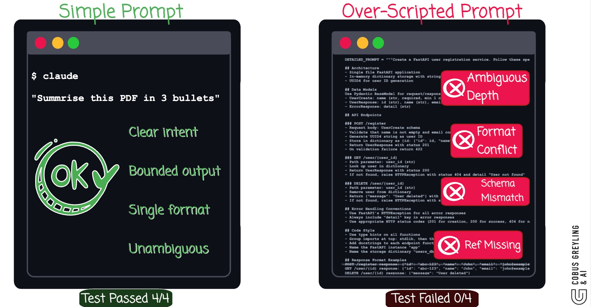
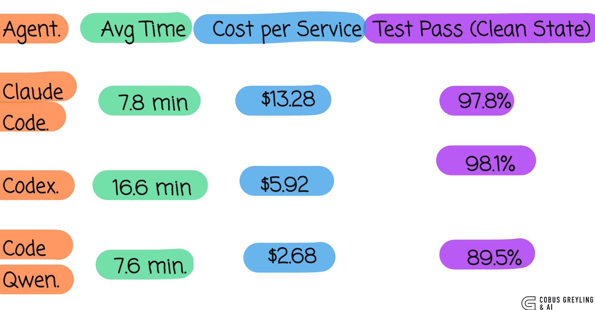

# AI Agents Are Better at Building From Scratch With Less Context

Two counterintuitive findings from a [study by Adnan et al.](https://arxiv.org/abs/2603.09004v1) that tested 144 AI-generated microservices across Claude Code, OpenAI Codex and Code Qwen.

**Finding 1** — Minimal prompts outperformed detailed prompts. More context made the code worse.

**Finding 2** — Building from scratch beat modifying existing systems. Clean state generation scored 81-98% on integration tests versus 50-76% for incremental generation.

## Simple vs Over-Scripted

## Cost and efficiency

## What is in this repo

- **blog.md** — Full blog post connecting the study to CLI-first development, universal agency and the Agent Harness Context Engine
- **minimal-vs-detailed-demo.py** — Python script that reproduces the core finding at a smaller scale using NVIDIA Nemotron 3 Super
- **generated_minimal.py** — FastAPI service generated from a one-sentence prompt (7/10 tests passed)
- **generated_detailed.py** — FastAPI service generated from a detailed prompt (0/3 tests — failed on import)
- **test_output.txt** — Full pytest output from both runs

## Related work

- [AI Harness Engineering](https://github.com/cobusgreyling/ai_harness_engineering)
- [Token as Hidden Compute Primitive](https://github.com/cobusgreyling/token-hidden-compute-primitive)
- [NVIDIA Nemotron 3 Super Budget Sweep](https://github.com/cobusgreyling/NVIDIA-Nemotron-3-Super)
- [Instruction Fade-Out](https://github.com/cobusgreyling/instruction-fadeout)
