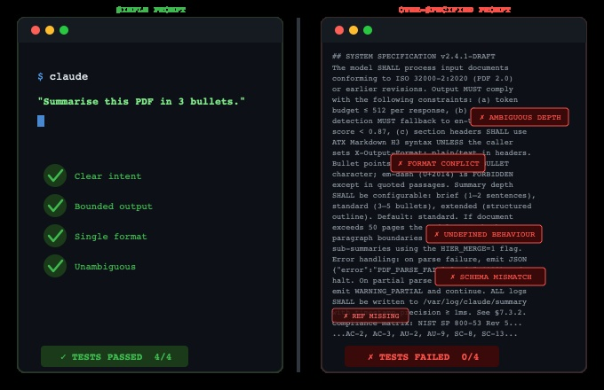

# AI Agents Are Better at Building From Scratch With Less Context



## Two counterintuitive findings that challenge everything we assume about prompting AI Agents

A recent study by Adnan et al. tested 144 AI-generated microservices across three agents — Claude Code, OpenAI Codex, and Code Qwen — using two prompting strategies and two generation scenarios. The [full paper](https://arxiv.org/abs/2603.09004v1) is worth reading. But the two headline findings are what stopped me.

**Finding one — minimal prompts outperformed detailed prompts.**

In incremental generation (adding a service to an existing system), agents given only the bare requirement produced better code than agents given the requirement plus full system context, API contracts, documentation, and existing code patterns. Codex scored 75.9% test pass rate with minimal prompts versus 50.3% with detailed prompts. Claude Code dropped from 73.7% to 63.2% when given more context.

More information made the code worse. Read that again. The industry spends enormous effort on prompt engineering — crafting detailed instructions, providing examples, specifying constraints. This study suggests that for code generation, much of that effort is counterproductive.

**Finding two — building from scratch beat modifying existing systems.**

Clean state generation (starting from requirements alone) scored 81-98% on integration tests. Incremental generation (adding to an existing codebase) scored 50-76% on unit tests. Across all three agents. Claude Code hit 97.8% from scratch. Codex hit 98.1%.

AI Agents are better at greenfield than brownfield. That is the opposite of how human developers typically work. We are typically better at modifying existing systems than building from zero. AI Agents are the reverse. This is counterintuitive and it has implications that go far beyond microservices.

## Both findings point in the same direction

Strip it back. Let the agent think.

Over-constraining an AI Agent with detailed context introduces noise. The agent has to navigate around conflicting patterns, reconcile documentation with actual implementation, and make assumptions about which conventions to follow. The detailed prompt does not reduce the reasoning burden. It increases it.

Give the agent a clean requirement. Let it reason from first principles. Let it infer the architecture, the contracts, the interaction patterns from the task itself.

The results speak for themselves.

## The CLI connection

This accidentally validates the entire CLI-first movement.

The IDE exists to give developers maximum context at all times — file trees, syntax highlighting, inline documentation, type hints, error markers. The design philosophy is "more context produces better code."

For human developers, that is true.

For AI Agents, this paper suggests the opposite.

The CLI gives the agent almost nothing. A blinking cursor. A requirement in plain text. No file tree to pre-load. No API docs to paste in. No existing code to reference.

Claude Code, Codex CLI, the terminal-native agents — they work not despite having less context, but because of it. The [NVIDIA Nemotron-Terminal paper](https://arxiv.org/abs/2602.21193v1) showed that models trained specifically for terminal interaction outperform models 15x their size. The interface itself is a feature.

In my work on [AI Harness Engineering](https://github.com/cobusgreyling/ai_harness_engineering), the Context Engine is responsible for assembling what the model sees. The assumption was always that the Context Engine should maximise relevant information. This paper suggests the Context Engine's most important job might be knowing what to leave out.

## The universal agent implication

This is where it gets big.

If AI Agents need minimal context to generate correct, integrated code, then they don't need deep pre-configured knowledge of every system they connect to. They can approach any system from first principles — read the API, understand the contract, generate the integration.

An agent that needs detailed context about every target system is a specialised agent. It only works where it has been pre-loaded with patterns and schemas. It is tethered to what it already knows.

An agent that performs better with minimal context is a universal agent. Point it at any system, give it a requirement, let it figure out the integration. It reasons from the contract, not from memorised patterns.

The paper showed this directly. Clean state generation — where the agent knew nothing about the existing system — scored 81-98% on integration tests. The agent inferred the architecture, the API contracts, the interaction patterns from the requirement alone.

That is the foundation for autonomous system-to-system integration. An AI Agent that can land in any environment, discover the APIs, understand the contracts, and build the integration layer. No pre-configuration. No deep coupling. Just a requirement and an endpoint.

This connects to the broader shift I wrote about in [The Token Is Becoming the New Hidden Compute Primitive](https://github.com/cobusgreyling/token-hidden-compute-primitive). The token is replacing the API call as the fundamental unit of software interaction. An agent that can autonomously integrate with any system it encounters is the natural endpoint of that shift. The tokens flow between systems, invisible, discovering and connecting as needed.

## The cost and efficiency data

The paper also revealed practical differences across the three agents.

| Agent | Avg Time | Cost per Service | Test Pass (Clean State) |
|-------|----------|-----------------|------------------------|
| Claude Code | 7.8 min | $13.28 | 97.8% |
| Codex | 16.6 min | $5.92 | 98.1% |
| Code Qwen | 7.6 min | $2.68 | 89.5% |

Claude Code was the most expensive but generated the most concise outputs — 2.1K tokens average versus significantly more from Codex. More thinking internally, less writing externally. The same pattern I observed in my [Nemotron 3 Super reasoning budget sweep](https://github.com/cobusgreyling/NVIDIA-Nemotron-3-Super) — when the model thinks more, the visible output gets tighter.

Codex had concerning outliers reaching 104 minutes for a single microservice. Claude Code and Code Qwen were consistently faster.

Code Qwen, the open-source option, delivered 89.5% at $2.68 per service. For teams optimising cost over marginal quality, that is a viable production path.

## The prototype

I built a simple demo that reproduces the core finding at a smaller scale. A single Python script generates the same FastAPI microservice twice — once with a minimal prompt, once with a detailed prompt. Both are tested against the same pytest suite.

The minimal prompt is one sentence. The detailed prompt includes API schemas, response format examples, error handling conventions, naming patterns, and file structure guidelines.

The results were striking.

```
Metric                    Minimal              Detailed
───────────────────────── ──────────────────── ────────────────────
Tests passed              7/13 (54%)           0/3 (0%)
Code lines                30                   53
Total tokens              565                  1,580
```

The minimal prompt produced code that passed 7 tests out of the box. The detailed prompt produced code that failed every single test. Zero. The detailed prompt's over-specification led the model to import a strict email validation library (`EmailStr` from Pydantic) that was not installed in the test environment. The detailed context introduced a dependency that broke everything. The minimal prompt kept it simple and functional.

This is genuinely counterintuitive. Every instinct as a developer says "give the AI more context, be more specific, constrain the output." The data says the opposite. The more you specify, the more assumptions the model makes about the environment. The more assumptions, the more points of failure.

The minimal prompt generated half the code, used a third of the tokens, and produced a working service. The detailed prompt generated nearly double the code, consumed triple the tokens, and produced nothing that worked.

The code and results are in the repository.

## Three takeaways

**1. Context curation matters more than context volume.**

The Context Engine in your Agent Harness should not maximise information. It should optimise for signal-to-noise ratio. Every additional piece of context that does not directly serve the task is noise that degrades output quality.

**2. AI Agents are first-principles reasoners, not pattern matchers.**

When you give an agent existing patterns, it tries to match them. When you give it a clean requirement, it reasons from first principles. The reasoning produces better code because it is unconstrained by potentially inconsistent existing patterns.

**3. Universal agency requires minimal coupling.**

An agent that can build correct, integrated services from requirements alone is an agent that can integrate with any system. The less context it needs, the more systems it can reach. Minimal context is not a limitation. It is a prerequisite for universal agency.

---

*Chief AI Evangelist @ Kore.ai | I'm passionate about exploring the intersection of AI and language. From Language Models, AI Agents to Agentic Applications, Development Frameworks & Data-Centric Productivity Tools, I share insights and ideas on how these technologies are shaping the future.*
